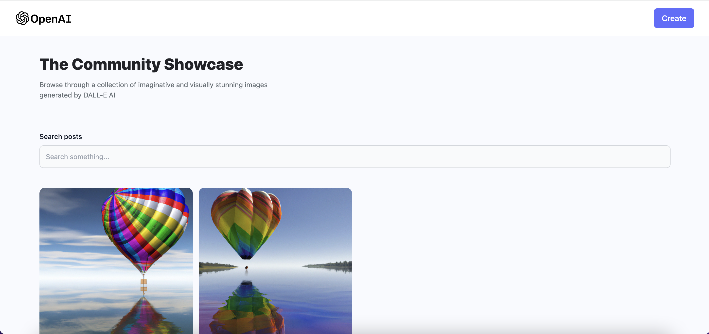
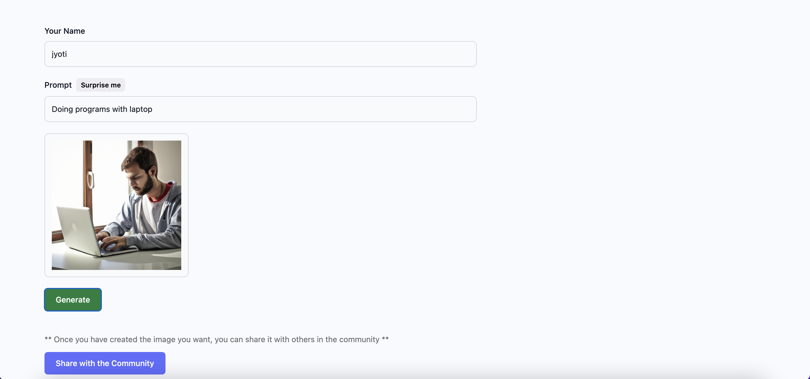

# Tools and Tricks

what i learnt from ai-generated-image project

## Authors

- [@Jyoti Prakash Mohanta](https://github.com/jyotiprakash-m)

## Features

- Use of open-ai API
- Node js backend with mongodb database
- Use of Cloudinary to store and generate image url
- Deploy both frontend and backend in differerent platform (render)

## Learning

## Deployment

This Project has both backend and frontend and deploy seperately

- [Backend](https://ai-image-generator-backend-nvtp.onrender.com)
- [Frontend](https://ai-image-generator-frontend.onrender.com)
